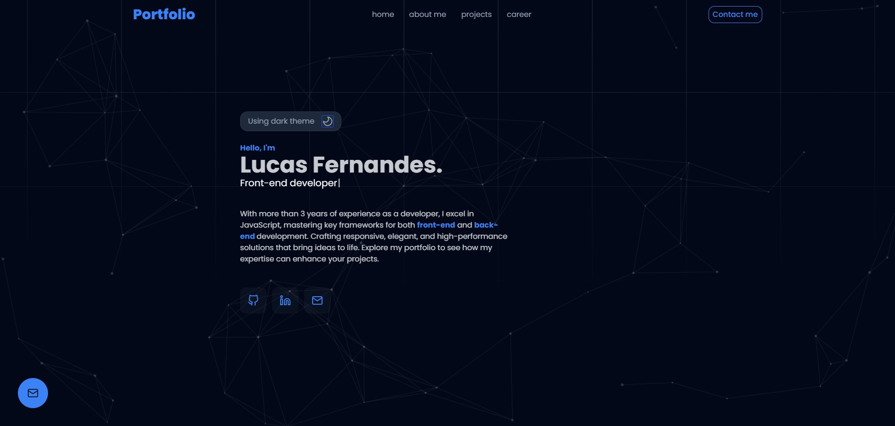

# ***Portfólio Web***


Bem-vindo ao meu projeto de portfólio web! Este projeto foi desenvolvido para mostrar minhas habilidades como desenvolvedor Full Stack. Ele foi construído usando Next.js, TypeScript e faz chamadas à API do GitHub para requisitar meus repositórios.

## ✨ Demonstração

<div align="center">
  
  
  [Visite o site](https://lucasfernandes.tech)
</div>

## 🚀 Tecnologias Utilizadas

- **Next.js**: Framework React para aplicações web com renderização híbrida
- **TypeScript**: Superconjunto do JavaScript que adiciona tipagem estática
- **API do GitHub**: Utilizada para obter informações dos repositórios do GitHub
- **Tailwind CSS**: Framework CSS utility-first para estilização rápida e responsiva
- **ShadCn UI**: Biblioteca de componentes acessíveis e customizáveis
- **Framer Motion**: Biblioteca para animações fluidas
- **Nodemailer**: Serviço para envio de emails através do formulário de contato

## 🛠️ Instalação e Uso

```bash
# Clone o repositório
git clone https://github.com/lucasfernandes20/portfolio_web.git

# Entre na pasta do projeto
cd portfolio_web

# Instale as dependências
npm install

# Execute o projeto em modo de desenvolvimento
npm run dev
```

Acesse `http://localhost:3000` para visualizar a aplicação.

## 📁 Estrutura do Projeto

```
.
├── components     # Componentes reutilizáveis do React
    ├── models           • Conteúdo da página
    ├── organisms        • Seções completas da interface que têm funcionalidades distintas
    ├── molecules        • Pequeno agrupamento funcional de elementos de interface
    └── ui               • Menores unidades de componentes
├── app         # Configuração das páginas da aplicação
    ├── utils            • Funções utilitárias e helpers
    ├── api              • Rota de api para envio de email
    ├── context          • ContextAPI (Estado global)
    └── assets           • Recursos reutilizáveis
├── services       # Serviços de requisições à API
├── data           # Conteúdo estático para ser utilizado no website
└── public         # Arquivos estáticos (imagens, fontes, etc)
```

## 🌟 Principais Funcionalidades

- **Tema Claro/Escuro**: Alternância entre temas com persistência da preferência do usuário
- **Integração com GitHub**: Exibição dinâmica dos repositórios
- **Formulário de Contato**: Envio de emails diretamente pelo site
- **Responsividade**: Layout adaptável para diferentes tamanhos de tela
- **Animações**: Transições e interações suaves utilizando Framer Motion

## 📞 Contato

Para mais informações ou qualquer dúvida, você pode me encontrar em:

- **Email**: [lucas.h.fernandes.reis@gmail.com](mailto:lucas.h.fernandes.reis@gmail.com)
- **LinkedIn**: [Lucas Fernandes Reis](https://linkedin.com/in/lucasfernandesreis)
- **GitHub**: [lucasfernandes20](https://github.com/lucasfernandes20)

---

<div align="center">
  <p>Feito por Lucas Fernandes</p>
</div>
